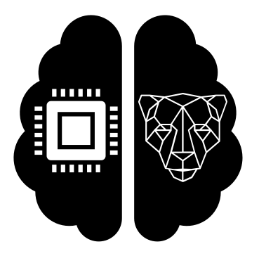

# Models 



# A) Usage on local machine


## 1. Required programs to run the models

 - [git](https://git-scm.com/downloads)
 - [protoc](https://github.com/protocolbuffers/protobuf/releases)


## 2. Install the tensorflow object detection api

Acording to the [official docs](https://tensorflow-object-detection-api-tutorial.readthedocs.io/en/latest/install.html#tensorflow-object-detection-api-installation)

Clone the tensorflow official repository
```
git clone https://github.com/tensorflow/models.git
```

Install with the commands

```
cd models/research
protoc object_detection/protos/*.proto --python_out=.
cp object_detection/packages/tf2/setup.py .
python -m pip install .
```

## 3. Clone this repo

```
git clone https://github.com/si-tecnologia/models
```

# B) Usage with Docker

DockerFile Example

```
FROM tensorflow/tensorflow:latest

RUN apt install git protobuf-compiler -y

RUN git clone --depth 1 https://github.com/tensorflow/models tf-models

WORKDIR /tf-models/research/

RUN protoc object_detection/protos/*.proto --python_out=.

RUN cp object_detection/packages/tf2/setup.py .

RUN python -m pip install .

WORKDIR /app

RUN git clone --depth 1 https://github.com/si-tecnologia/models

COPY src/requirements.txt /

RUN pip install -r /requirements.txt

COPY src/ /app

```


## 4. Convertendo para o tflite

instalar o TensorFlow com:

```
pip install tensorflow==2.2.0

# ou com GPU

pip install tensorflow-gpu==2.2.2

# para converter para o tflite

pip install tf-nightly
```

https://www.tensorflow.org/install/gpu

para converter o modelo:

```
python convert_tflite.py
```

No caso de erro:

tflite ValueError: None is only supported in the 1st dimension. Tensor 'input_tensor' has invalid shape, atualizar para versão tf-nightly e rodar:

```
python convert_tflite.py
```

Referência: https://github.com/tensorflow/tensorflow/issues/22564
